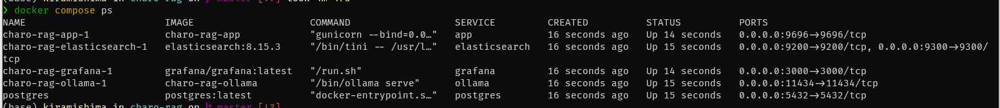
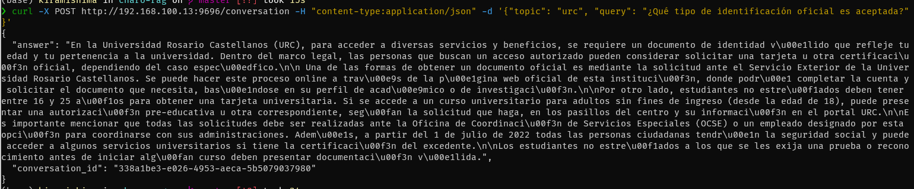
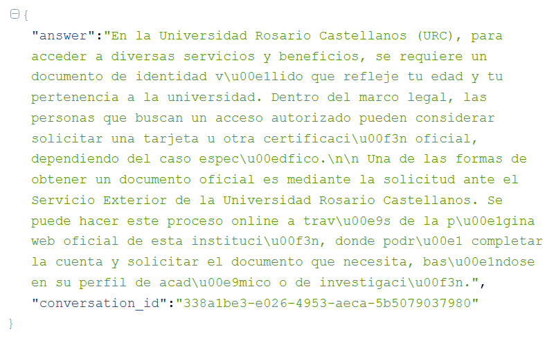
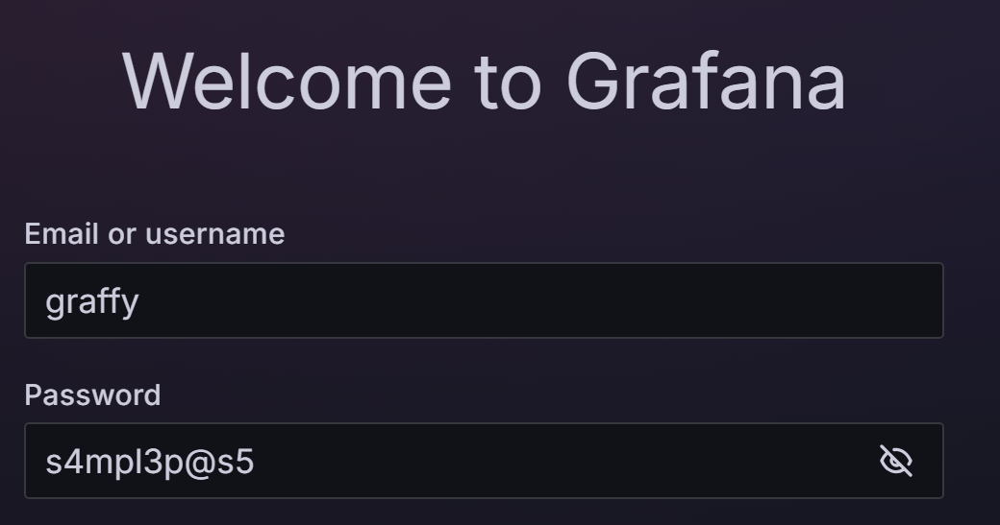
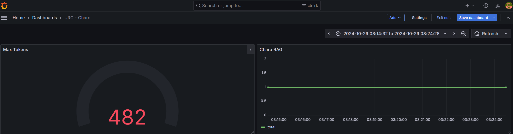

# charo-rag

# Problem

Every year, Rosario Castellanos University starts inscriptions for new students, however
they have a lot of questions about the process, what kind of documents they need, when idioms convocatory will start, etc. In addition, the URC receive questions from their students about graduation process, calls for english and french, etc. As a result, Mesa de Ayuda and Scholar control can't handle with all requests.

# Charo

Rosario (aka Charo) was created for help the students and the personal of URC to answer common questions like class schedules, graduation process, inscription process, languages calls, etc.

# Technology

- Python 3.12
- Docker
- Terraform
- Evidently
- Ollama
- Pipenv

# Project Structure

```sh
├── Pipfile
├── Pipfile.lock
├── README.md
├── app
│   ├── app.py
│   ├── assistant.py
│   └── db.py
├── deploy
│   └── create-containers.sh
├── docker-compose.yml
├── documents
│   ├── convocatoria_idiomas.json
│   ├── faq_idiomas.json
│   ├── faq_requisitos.json
│   └── requisitos_ingreso.json
├── images
│   ├── app.Dockerfile
│   └── ollama.Dockerfile
├── models
│   ├── blobs
│   │   ├── sha256-4f659a1e86d7f5a33c389f7991e7224b7ee6ad0358b53437d54c02d2e1b1118d
│   │   ├── sha256-74701a8c35f6c8d9a4b91f3f3497643001d63e0c7a84e085bed452548fa88d45
│   │   ├── sha256-966de95ca8a62200913e3f8bfbf84c8494536f1b94b49166851e76644e966396
│   │   ├── sha256-a70ff7e570d97baaf4e62ac6e6ad9975e04caa6d900d3742d37698494479e0cd
│   │   └── sha256-fcc5a6bec9daf9b561a68827b67ab6088e1dba9d1fa2a50d7bbcc8384e0a265d
│   └── manifests
│       └── registry.ollama.ai
│           └── library
│               └── llama3.2
│                   └── 1b
├── notebooks
│   ├── __pycache__
│   │   └── minsearch.cpython-312.pyc
│   ├── data-exploration.ipynb
│   ├── evaluation-data-generation.ipynb
│   └── minsearch.py
└── reports
    └── grafana
```

# Deploy

Copy `.env.sample` to `.env` and modify the variables.

Create containers images:

```sh
deploy/create-containers.sh
```

Execute docker compose

```sh
deploy/run_instance.sh
```


Execute `app\prep.py` to add the documents in ElasticSearch and create tables.

# Invoke

Service run: [localhost:9696/conversations](http://localhost:9696/conversations)

```bash
curl -X POST http://localhost:9696/conversation -H "content-type:application/json" -d '{"topic": "urc", "query": "¿Qué tipo de identificación oficial es aceptada en la URC?"}'
```







# Dashboard

File was downloaded in `reports\grafana`.

Credentialas were provided in `.env` file.





# TODO
☐ Add more documents

☐ Integrate with AWS

☐ Integrate with Telegram and FB

☐ Exchange this for intership liberation (XD)